# Lambda → SNS Notification Pipeline


## Mission Objective

* Stand up a fully serverless, Terraform-defined pipeline where an **AWS Lambda** function behind a public **Function URL** publishes to an **Amazon SNS** topic that emails every confirmed subscriber, secured by least-privilege **IAM** and traced end-to-end in **CloudWatch Logs**.

## Architecture

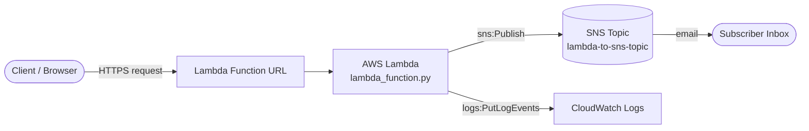

Everything above — the topic, the IAM role/policy, and the function itself — is defined as code in [`main.tf`](main.tf) and provisioned with a single `terraform apply`.

## Checkpoints

1. [Prerequisites](#prerequisites)
2. [Project Structure](#project-structure)
3. [Step-1: Provision the SNS Topic & IAM Role](#step-1-provision-the-sns-topic--iam-role)
4. [Step-2: Package & Deploy the Lambda Function](#step-2-package--deploy-the-lambda-function)
5. [Step-3: Expose & Trigger the Function URL](#step-3-expose--trigger-the-function-url)
6. [Step-4: Verify Execution in CloudWatch](#step-4-verify-execution-in-cloudwatch)
7. [Step-5: Subscribe & Confirm Email Delivery](#step-5-subscribe--confirm-email-delivery)
8. [Step-6: Live Notifications](#step-6-live-notifications)
9. [Errors](#errors)
10. [Deliverables](#deliverables)
11. [Teardown](#final-step---teardown)
12. [Author](#author)

## Prerequisites

* An AWS account with console + CLI access
* [Terraform](https://developer.hashicorp.com/terraform/downloads) `>= 1.5.0`
* Visual Studio Code (or any editor)
* Python 3.12 (matches the Lambda runtime)
* Patience & lots of coffee


## Step-1 (Provision the SNS Topic & IAM Role)

`main.tf` creates the `aws_sns_topic` that will fan out notifications, plus an `aws_iam_role` scoped to exactly two things: writing CloudWatch logs and publishing to that one topic.

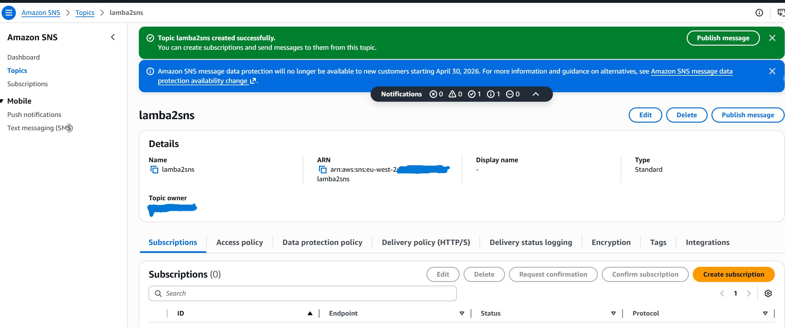

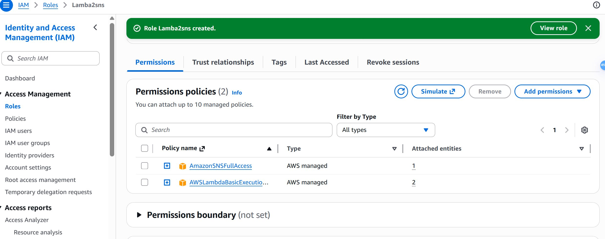

## Step-2 (Package & Deploy the Lambda Function)

Terraform's `archive_file` data source zips [`lambda_function.py`](lambda_function.py) and deploys it as a Python 3.12 Lambda. The function reads the topic ARN from an environment variable and publishes a JSON payload on every invocation.

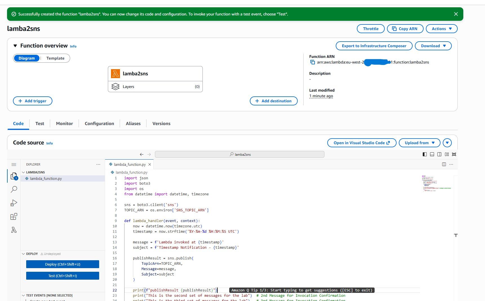

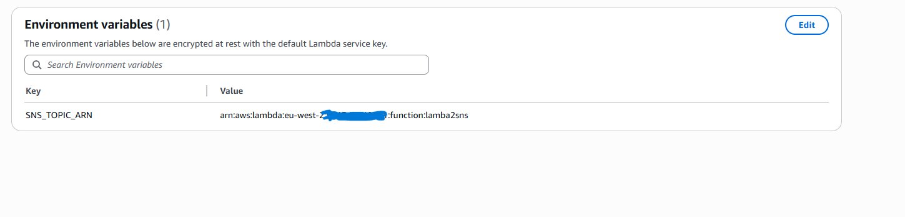

## Step-3 (Expose & Trigger the Function URL)

A public Function URL turns the Lambda into a one-click HTTP trigger — handy for testing without needing API Gateway or the CLI.

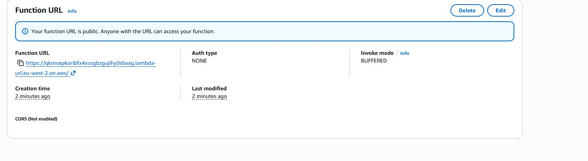

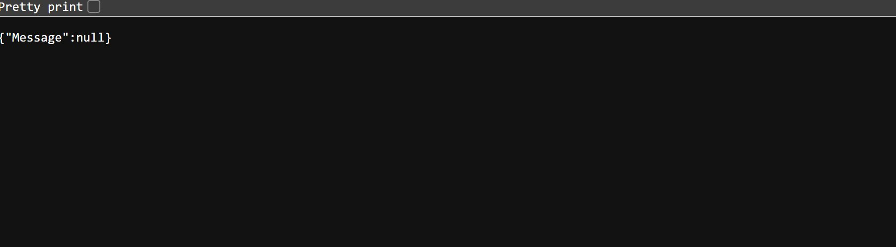

## Step-4 (Verify Execution in CloudWatch)

Every invocation is traced end-to-end in CloudWatch Logs — the `sns.publish()` response (including the returned `MessageId`), plus the billed duration and memory usage.

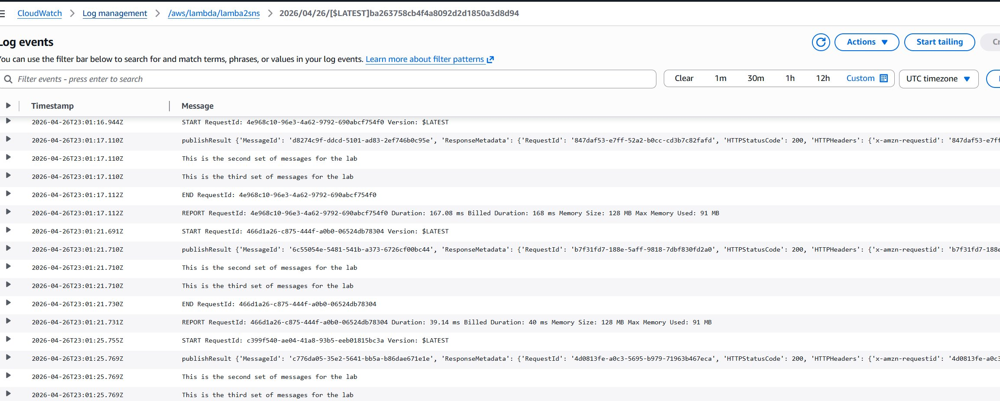

## Step-5 (Subscribe & Confirm Email Delivery)

Before a subscriber can receive anything, SNS sends a confirmation link. Once it's clicked, the subscription flips to `Confirmed` and the topic is ready to deliver.

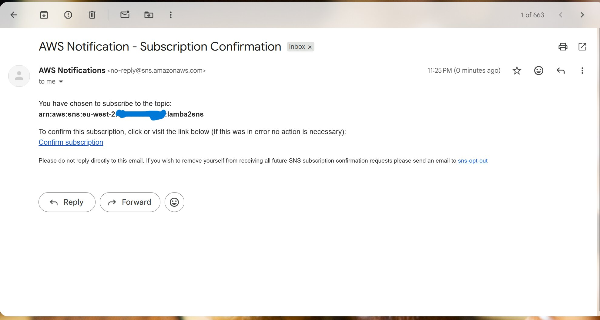

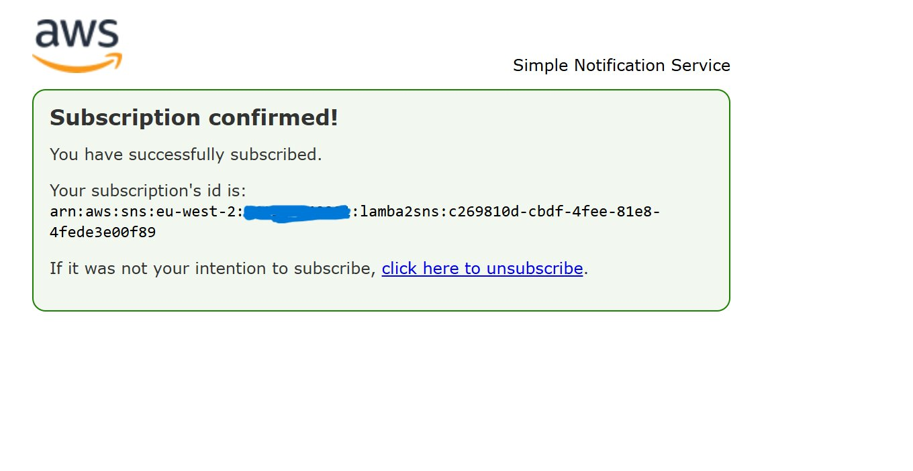

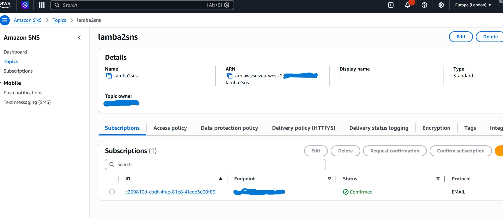

## Step-6 (Live Notifications)

With the subscription active, every Function URL hit results in a real email notification, timestamped by the Lambda at invocation time.

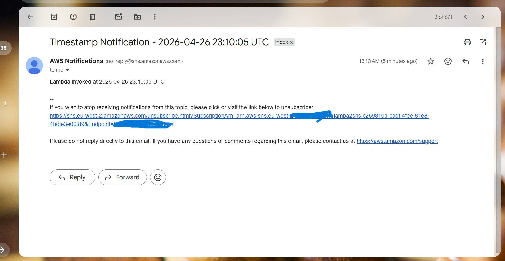

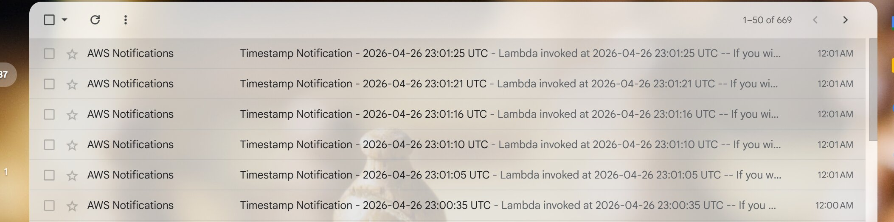

## Errors

* `AccessDenied` on `sns:Publish` — the IAM policy's `Resource` must match the topic's ARN exactly; double-check region/account ID.
* Function URL returns `{"Message":null}` — this is CloudFront/API Gateway's default 200 response body when the Lambda return value doesn't map cleanly to the console's raw view; check CloudWatch Logs for the real `publishResult`, not the browser output.
* No email arrives — the subscription is still `PendingConfirmation`; check spam/junk for the confirmation email and click the link before testing again.

## Deliverables

* A working, fully Terraform-managed serverless pipeline: Lambda → SNS → Email, with least-privilege IAM and CloudWatch observability.
* Screenshots of every stage captured for the record — see the [`Images/`](Images) folder.
* Congrats, you have successfully completed your mission and are now ready for more pain.

## Teardown

Unless you can print your own money, you will need to tear down your deployment.

```bash
terraform destroy
```

* You will be asked to confirm deletion — say yes.
* Double check your AWS console that the SNS topic, IAM role, and Lambda function are gone.
* Triple check everything — Jeff Bezos has enough money.

## Author

**Benjamin Cooper**
