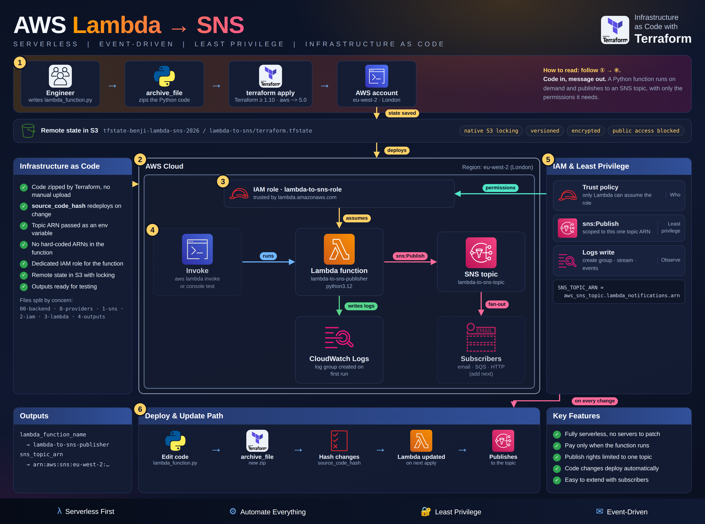
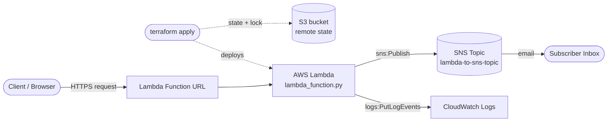

# Lambda → SNS Notification Pipeline


## Mission Objective

* Build a serverless, event-driven notification pipeline on AWS. A Python **AWS Lambda** function publishes to an **Amazon SNS** topic, which emails every confirmed subscriber. **Terraform** defines the core infrastructure, **IAM** gives the function only the permissions it needs, and every run is traced in **CloudWatch Logs**. Terraform state is stored remotely in **Amazon S3**, encrypted and with state locking.
* **Skills shown:** Infrastructure as Code, remote state management, serverless compute, least-privilege IAM, event-driven (pub/sub) design, observability and cost-aware cleanup.

## Architecture





Terraform manages the SNS topic, the IAM role and policy, and the Lambda function in `eu-west-2` (London). The code is split into separate files for providers, SNS, IAM, Lambda, outputs and the backend. I set up the Function URL and the email subscription in the AWS console for testing.

The state file isn't kept on my laptop. `5-backend.tf` stores it in the S3 bucket `tfstate-benji-lambda-sns-2026` under `lambda-to-sns/terraform.tfstate`, encrypted at rest. Terraform's native S3 locking (`use_lockfile`) stops two `apply` runs from changing the state at the same time, so no DynamoDB table is needed.

## Checkpoints

1. [Prerequisites](#prerequisites)
2. [Step-1: Provision the SNS Topic & IAM Role](#step-1-provision-the-sns-topic--iam-role)
3. [Step-2: Package & Deploy the Lambda Function](#step-2-package--deploy-the-lambda-function)
4. [Step-3: Expose & Trigger the Function URL](#step-3-expose--trigger-the-function-url)
5. [Step-4: Verify Execution in CloudWatch](#step-4-verify-execution-in-cloudwatch)
6. [Step-5: Subscribe & Confirm Email Delivery](#step-5-subscribe--confirm-email-delivery)
7. [Step-6: Live Notifications](#step-6-live-notifications)
8. [Errors](#errors)
9. [Deliverables](#deliverables)
10. [Teardown](#teardown)
11. [Author](#author)
12. [License](#license)

## Prerequisites

* An AWS account with console and CLI access
* [Terraform](https://developer.hashicorp.com/terraform/downloads) `>= 1.10` (needed for native S3 state locking)
* An existing S3 bucket for the remote state (Terraform won't create the bucket its own backend uses)
* Visual Studio Code (or any editor)
* Python 3.12 (matches the Lambda runtime)
* Patience & lots of coffee

## Step-1 (Provision the SNS Topic & IAM Role)

Terraform creates the SNS topic and an IAM role that only the Lambda service can assume. The role can do two things: write its own logs and publish to this one topic.


## Step-2 (Package & Deploy the Lambda Function)

Terraform zips `lambda_function.py` and deploys it as a Python 3.12 function, and redeploys it whenever the code changes. The function reads the topic ARN from an environment variable set by Terraform, so no ARN is hard-coded. On each run it publishes a JSON message with the subject "Lambda Notification", including the event that triggered it.


## Step-3 (Expose & Trigger the Function URL)

A Lambda Function URL turns the function into an HTTPS endpoint, so I could test it from a browser without setting up API Gateway.


## Step-4 (Verify Execution in CloudWatch)

I checked every run in CloudWatch Logs: the SNS publish response (including the `MessageId`), plus how long it ran and how much memory it used.


## Step-5 (Subscribe & Confirm Email Delivery)

SNS only delivers to subscribers who opt in. After I clicked the confirmation link, the subscription changed to `Confirmed` and the topic was ready to deliver.


## Step-6 (Live Notifications)

Each time the function runs, an email with a timestamp arrives, which confirms the whole Lambda → SNS → inbox path works.


## Errors

* **`AccessDenied` on `sns:Publish`.** The policy is scoped to one topic, so the resource ARN has to match exactly (region, account and topic name). I fixed it by using Terraform's reference to the topic ARN instead of typing the ARN by hand.
* **The browser response didn't show the real result.** The raw Function URL output was misleading. I used the CloudWatch logs, which show the actual SNS publish result, to confirm it worked.
* **No emails arrived.** The subscription was still `PendingConfirmation`. SNS doesn't deliver until the subscriber clicks the confirmation link (it had gone to spam).

## Deliverables

* A working serverless pipeline (Lambda → SNS → Email), with the core infrastructure in Terraform, least-privilege IAM, CloudWatch logging and remote state in S3 with locking.
* Screenshots of every stage in the [`Images/`](Images) folder.
* Congrats, you have successfully completed your mission and are now ready for more pain.

## Teardown

Unless you can print your own money, you will need to tear down your deployment.

```bash
terraform destroy
```

* You will be asked to confirm deletion. Say yes.
* Double check in the AWS console that the SNS topic, IAM role and Lambda function are gone.
* Lambda creates the CloudWatch log group `/aws/lambda/lambda-to-sns-publisher` when it runs, so `terraform destroy` leaves it behind. Delete it manually.
* The S3 state bucket isn't managed by this project, so it survives `destroy` too. Empty and delete it only once you're finished with the project for good.
* Triple check everything. Jeff Bezos has enough money.

## Author

**Benjamin Cooper**

## License

Licensed under the Apache License 2.0. See [`LICENSE.md`](LICENSE.md).
